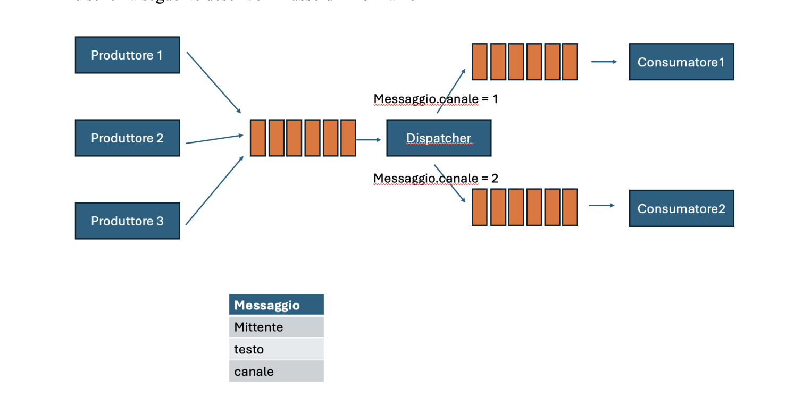

# 📬 Message Dispatcher – Producer / Consumer with Dedicated Queues (Java 21)

This project implements a **multi-producer, multi-consumer message dispatcher system** with a **central queue and multiple dedicated channel queues**, fully developed using **low-level synchronization primitives** and **Java 21 Virtual Threads**.

It is designed as a concurrency exercise focused on:
- thread coordination,
- bounded circular queues,
- thread-safe communication,
- and correct handling of thread interruption.

---

## 🧩 System Architecture



### Message Flow

1. **Multiple Producers** generate messages and insert them into a **common bounded queue**.
2. Each message contains a **channel attribute** with a value between **1 and 4**.
3. A dedicated **Dispatcher thread**:
   - waits for messages on the common queue,
   - extracts each message,
   - forwards it to one of the **four dedicated channel queues**.
4. A **Consumer thread** is associated with **each channel queue** and continuously consumes messages.
5. Every enqueue/dequeue operation prints:
   - the processed message,
   - the name of the thread that performed the operation,
   - a timestamp in the **Europe/Paris** timezone.

---

## ✅ Functional Requirements

- Multiple producers and multiple consumers.
- A **central dispatcher** routes messages to **dedicated queues based on channel**.
- Channels are numeric and range from **1 to 4**.
- Every queue operation logs:
  - message content,
  - executing thread,
  - timestamp.

---

## 🔐 Technical Constraints

- ❌ **No usage of high-level concurrency utilities**
  - **Forbidden:** `BlockingQueue`, `ArrayBlockingQueue`, `ConcurrentLinkedQueue`, etc.
- ✅ **Custom circular bounded queue implemented on arrays**
- ✅ **Thread-safe queues**
- ✅ **Producers block if the queue is full**
- ✅ **Consumers block if the queue is empty**
- ✅ **Thread interruptions handled safely**
  - Threads terminate gracefully or propagate interruption correctly.

---

## ⚙️ Technologies & Features

- **Java 21**
- ✅ **Virtual Threads (Project Loom)**
- ✅ Low-level synchronization with:
  - `synchronized`
  - `wait() / notifyAll()`
- ✅ Circular bounded queues
- ✅ Timestamped logging with:
  - `ZonedDateTime`
  - Timezone: `Europe/Paris`

---

## 📦 Project Structure

src/main/java/org/demo/prodcon
│
├── Consumer.java # Channel-specific consumer
├── Dispatcher.java # Central message dispatcher
├── Message.java # Message model with channel
├── Producer.java # Message producer
├── Utils.java # Timestamp logger (Europe/Paris)


Main execution:
- The `main` class initializes:
  - Producers
  - Dispatcher
  - Consumers
- All threads are started as **Virtual Threads**
- The system runs **indefinitely**, producing and consuming messages continuously.

---

## ▶️ How to Run

After building the project, execute the following command:

```bash
java -jar target/prodcon-1.0-SNAPSHOT.jar

